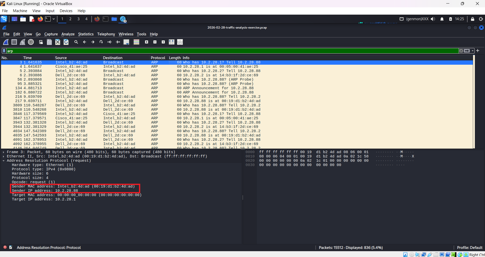
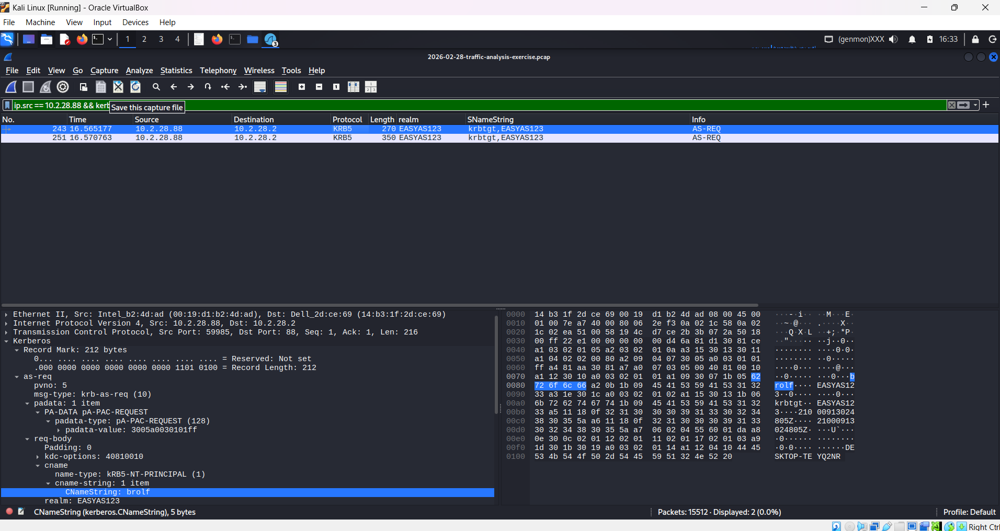
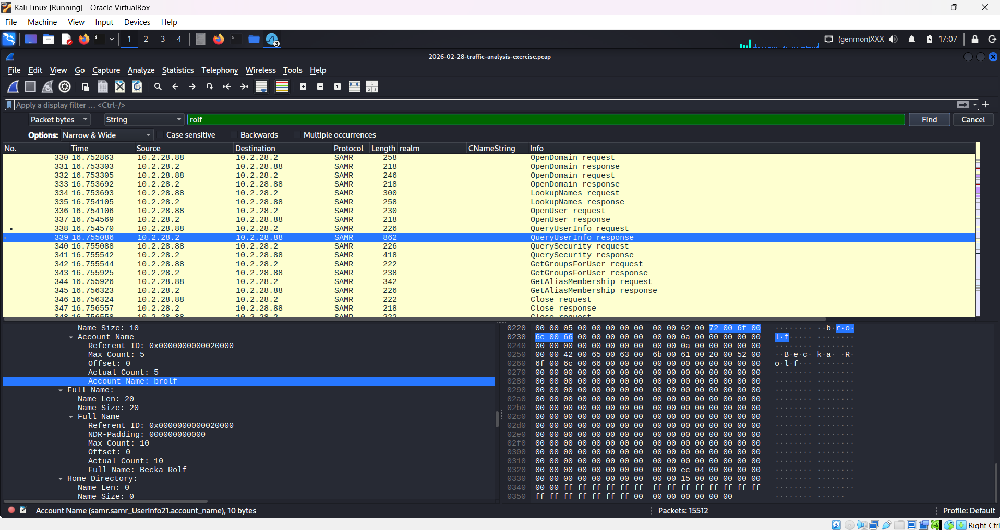

# Wireshark: Malware Traffic Analysis — NetSupport Manager RAT

## Overview

This investigation focused on analyzing a packet capture associated with a **NetSupport Manager Remote Access Trojan (RAT)** detection. The SOC received several SIEM signature hits indicating NetSupport Manager RAT traffic originating from `45.131.214.85` over **TCP port 443**. The activity began on **2026-02-28 at 19:55 UTC**.

The objective of the investigation was to identify the infected Windows client and determine the associated network, host, and user-account information using Wireshark.

The packet capture was obtained from **malware-traffic-analysis.net**.

## Tools Used

- Kali Linux
- Wireshark
- Packet Capture (PCAP)
- malware-traffic-analysis.net

---

# Investigation Summary

## 1. Identify the Infected Windows Client

The first step was to identify which internal IP address was responsible for the suspicious traffic.

### Navigation Used

- **Statistics → Conversations → IPv4**

### Key Finding

| Investigation | Result |
| --- | --- |
| Infected Windows client IP | `10.2.28.88` |

The IPv4 conversation statistics were used to identify the internal host associated with the suspicious communication.

---

## 2. Identify the MAC Address

After identifying the infected host IP address, ARP traffic was analyzed to determine the corresponding MAC address.

### Display Filter Used

```text
arp
```

The ARP packets were inspected to associate `10.2.28.88` with its hardware address.

### Key Finding

| Investigation | Result |
| --- | --- |
| Infected Windows client IP | `10.2.28.88` |
| MAC address | `00:19:d1:b2:4d:ad` |

The ARP packet inspection showed the infected client's MAC address as `00:19:d1:b2:4d:ad`.



---

## 3. Identify the Windows Hostname

The next step was to determine the hostname of the infected Windows machine.

### Display Filter Used

```text
nbns && ip.addr == 10.2.28.88
```

NetBIOS Name Service traffic was filtered for the infected IP address.

### Key Finding

| Investigation | Result |
| --- | --- |
| Hostname | `DESKTOP-TEYQ2NR` |

The NBNS traffic revealed the hostname associated with the infected Windows client.

---

## 4. Identify the User Account

Kerberos traffic was then examined to determine which user account was associated with the infected Windows client.

### Display Filter Used

```text
ip.src == 10.2.28.88 && Kerberos.CNameString
```

The Kerberos `CNameString` field was inspected to identify the account name.

### Key Finding

| Investigation | Result |
| --- | --- |
| User account | `brolf` |

The account name observed in the Kerberos traffic was `brolf`.



---

## 5. Identify the Full Name of the User

The account name was then used to locate the user's full name within the captured traffic.

### Navigation Used

- **Edit → Find Packet**
- Search type: **String**
- Search area: **Packet bytes**
- Search term:

```text
rolf
```

The relevant SMB/SAMR traffic was inspected to identify the full account name associated with the username.

### Key Finding

| Investigation | Result |
| --- | --- |
| User account | `brolf` |
| Full name | `Becka Rolf` |

The captured traffic revealed that the `brolf` account belongs to **Becka Rolf**.



---

# Incident Indicators

The following indicators were identified during the investigation:

| Indicator | Value |
| --- | --- |
| Malware | NetSupport Manager RAT |
| External IP | `45.131.214.85` |
| External port | `TCP/443` |
| Infected client IP | `10.2.28.88` |
| Infected client MAC | `00:19:d1:b2:4d:ad` |
| Hostname | `DESKTOP-TEYQ2NR` |
| User account | `brolf` |
| User full name | `Becka Rolf` |
| Activity start | `2026-02-28 19:55 UTC` |

---

# Network Environment

The packet capture investigation was performed within the following environment:

| Network Information | Value |
| --- | --- |
| LAN segment | `10.2.28.0/24` |
| Domain | `easyas123.tech` |
| AD environment | `EASYAS123` |
| Domain Controller | `10.2.28.2` (`EASYAS123-DC`) |
| Gateway | `10.2.28.1` |
| Broadcast address | `10.2.28.255` |

---

# Investigation Methodology

The investigation followed a simple network-forensics workflow:

1. Identify the suspicious internal host using Wireshark conversation statistics.
2. Use ARP traffic to determine the infected host's MAC address.
3. Use NBNS traffic to identify the Windows hostname.
4. Inspect Kerberos traffic to identify the logged-in user account.
5. Search SMB/SAMR-related traffic to determine the user's full name.
6. Consolidate the findings into an incident timeline and indicator table.

---

# Skills Demonstrated

- Malware Traffic Analysis
- Wireshark Packet Analysis
- IPv4 Conversation Analysis
- ARP Analysis
- NBNS Analysis
- Kerberos Traffic Analysis
- Display Filtering
- Indicator of Compromise (IOC) Identification

---

# Lessons Learned

- Wireshark can be used to trace suspicious activity from an external indicator back to a specific internal host.
- **Statistics → Conversations** can quickly help identify communicating internal systems.
- ARP traffic can associate an IP address with a MAC address.
- NBNS traffic can reveal Windows hostnames.
- Kerberos traffic can expose the account name associated with network authentication activity.
- SMB/SAMR traffic can contain additional account information, including a user's full name.
- Combining multiple protocols provides much stronger attribution than relying on a single packet or display filter.
- A packet capture can provide enough information to identify the affected endpoint and the user associated with the activity.

---

# Conclusion

The packet capture analysis identified the compromised Windows endpoint as:

**`DESKTOP-TEYQ2NR` — `10.2.28.88` — `00:19:d1:b2:4d:ad`**

The associated user account was **`brolf`**, belonging to **Becka Rolf**.

The suspicious activity was associated with **NetSupport Manager RAT** communicating with the external IP address **`45.131.214.85` over TCP/443`**.

These findings provide the SOC with the key endpoint and user information required to locate the affected computer and begin containment and remediation.

---
