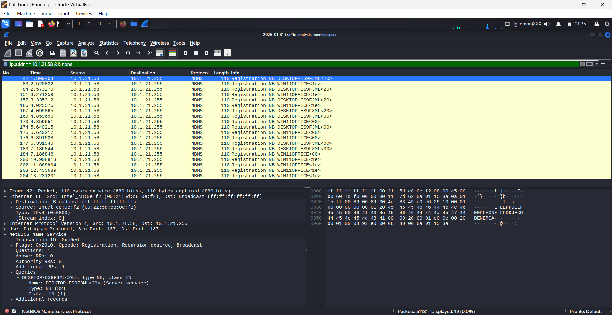
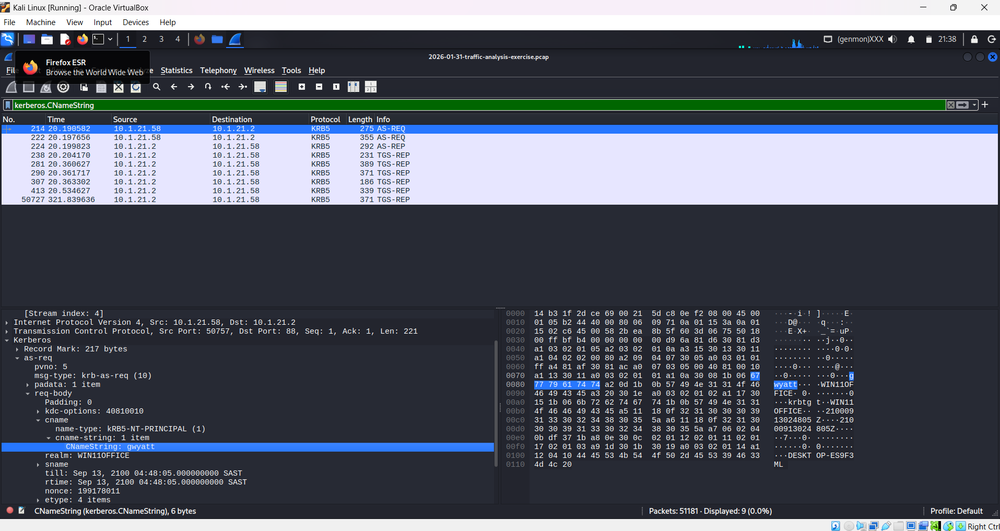
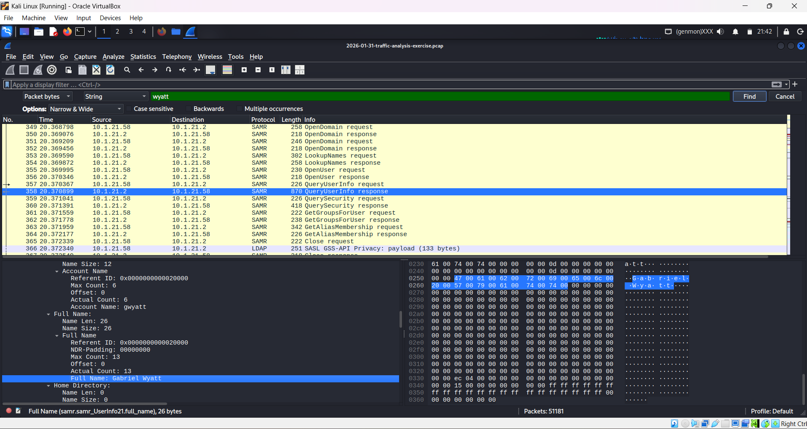
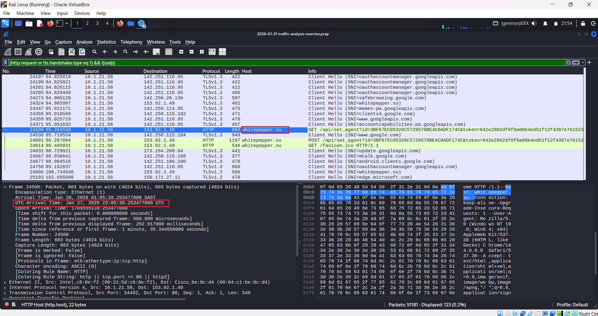

# Wireshark: Malware Traffic Analysis — Lumma Stealer

## Overview

This investigation focused on analyzing a packet capture associated with an **ET MALWARE Lumma Stealer Victim Fingerprinting Activity** detection. The SOC received a signature hit indicating suspicious traffic originating from `153.92.1[.]49` over **TCP port 80**. The alert triggered on **2026-01-27 at 23:05 UTC**.

The objective of the investigation was to identify the infected Windows client and determine the associated network, host, and user-account information using Wireshark.

The packet capture was obtained from the internal IP address that triggered the alert.

## Tools Used

* Kali Linux
* Wireshark
* Packet Capture (PCAP)

---

# Investigation Summary

## 1. Identify the Infected Windows Client

The first step was to identify which internal IP address was responsible for the suspicious traffic.

### Navigation Used

* **Statistics → Conversations → IPv4**

The IPv4 conversation statistics were inspected to identify the internal host associated with the suspicious communication.

### Key Finding

| Investigation              | Result       |
| -------------------------- | ------------ |
| Infected Windows client IP | `10.1.21.58` |

The infected Windows client was identified as `10.1.21.58`.

---

## 2. Identify the MAC Address

After identifying the infected host IP address, the traffic associated with the internal IP was filtered to determine the corresponding MAC address.

### Display Filter Used

```text
ip.addr == 10.1.21.58
```

The packets associated with `10.1.21.58` were inspected to identify the client's hardware address.

### Key Finding

| Investigation              | Result              |
| -------------------------- | ------------------- |
| Infected Windows client IP | `10.1.21.58`        |
| MAC address                | `00:21:5d:c8:0e:f2` |

The infected client's MAC address was identified as `00:21:5d:c8:0e:f2`.

---

## 3. Identify the Windows Hostname

The next step was to determine the hostname of the infected Windows machine.

### Display Filter Used

```text
ip.addr == 10.1.21.58 && nbns
```

NetBIOS Name Service traffic was filtered for the infected IP address.

### Key Finding

| Investigation | Result            |
| ------------- | ----------------- |
| Hostname      | `DESKTOP-ES9F3ML` |

The NBNS traffic revealed the hostname associated with the infected Windows client as `DESKTOP-ES9F3ML`.



---

## 4. Identify the User Account

Kerberos traffic was then examined to determine which user account was associated with the infected Windows client.

### Display Filter Used

```text
Kerberos.CNameString
```

The Kerberos `CNameString` field was inspected to identify the account name.

### Key Finding

| Investigation | Result   |
| ------------- | -------- |
| User account  | `gwyatt` |

The account name observed in the Kerberos traffic was `gwyatt`.



---

## 5. Identify the Full Name of the User

The account name was then used to locate the user's full name within the captured traffic.

### Navigation Used

* **Edit → Find Packet**
* Search type: **String**
* Search area: **Packet bytes**
* Search term:

```text
wyatt
```

The relevant packet data was inspected to identify the full name associated with the username.

### Key Finding

| Investigation | Result          |
| ------------- | --------------- |
| User account  | `gwyatt`        |
| Full name     | `Gabriel Wyatt` |

The captured traffic revealed that the `gwyatt` account belongs to **Gabriel Wyatt**.



---

## 6. Identify the Malicious Domain

The next step was to identify the domain associated with the external IP address that triggered the Lumma Stealer detection.

### Display Filter Used

```text
(http.request or tls.handshake.type eq 1) && !(ssdp)
```

HTTP request and TLS handshake traffic was filtered to identify domain names associated with the suspicious communication.

### Key Finding

| Investigation    | Result             |
| ---------------- | ------------------ |
| External IP      | `153.92.1[.]49`    |
| Malicious domain | `whitepepper[.]su` |

The traffic associated with the Lumma Stealer alert identified `whitepepper[.]su` as the domain associated with the external IP address.



---

# Incident Indicators

The following indicators were identified during the investigation:

| Indicator           | Value                                                   |
| ------------------- | ------------------------------------------------------- |
| Malware detection   | ET MALWARE Lumma Stealer Victim Fingerprinting Activity |
| External IP         | `153.92.1[.]49`                                         |
| External port       | `TCP/80`                                                |
| Malicious domain    | `whitepepper[.]su`                                      |
| Infected client IP  | `10.1.21.58`                                            |
| Infected client MAC | `00:21:5d:c8:0e:f2`                                     |
| Hostname            | `DESKTOP-ES9F3ML`                                       |
| User account        | `gwyatt`                                                |
| User full name      | `Gabriel Wyatt`                                         |
| Alert time          | `2026-01-27 23:05 UTC`                                  |

---

# Network Environment

The packet capture investigation was performed within the following environment:

| Network Information | Value                           |
| ------------------- | ------------------------------- |
| LAN segment         | `10.1.21.0/24`                  |
| Domain              | `win11office[.]com`             |
| AD environment      | `WIN11OFFICE`                   |
| Domain Controller   | `10.1.21.2` (`WIN-LU4L24X3UB7`) |
| Gateway             | `10.1.21.1`                     |
| Broadcast address   | `10.1.21.255`                   |

---

# Investigation Methodology

The investigation followed a network-forensics workflow:

1. Identify the suspicious external communication and associated internal host.
2. Use **Statistics → Conversations → IPv4** to identify the infected Windows client.
3. Filter traffic for the identified internal IP address to determine the client's MAC address.
4. Use NBNS traffic to identify the Windows hostname.
5. Inspect Kerberos `CNameString` traffic to identify the associated user account.
6. Search packet bytes for the user's surname to determine the user's full name.
7. Filter HTTP and TLS traffic to identify the domain associated with the suspicious external IP.
8. Consolidate the findings into an incident indicator table for incident response.

---

# Skills Demonstrated

* Malware Traffic Analysis
* Wireshark Packet Analysis
* IPv4 Conversation Analysis
* MAC Address Identification
* NBNS Analysis
* Kerberos Traffic Analysis
* HTTP Traffic Analysis
* TLS Traffic Analysis
* Display Filtering
* Indicator of Compromise (IOC) Identification
* Endpoint and User Attribution

---

# Lessons Learned

* Wireshark can be used to trace suspicious external communication back to a specific internal Windows endpoint.
* **Statistics → Conversations → IPv4** can quickly identify hosts communicating with suspicious infrastructure.
* Filtering traffic by an internal IP address can help correlate network-layer information with the affected endpoint.
* NBNS traffic can reveal Windows hostnames.
* Kerberos traffic can expose the account name associated with authentication activity.
* Packet-byte searches can reveal additional user information contained within captured network traffic.
* HTTP and TLS handshake traffic can help identify domains associated with suspicious IP addresses.
* Combining information from multiple protocols provides stronger endpoint and user attribution than relying on a single packet or protocol.

---

# Conclusion

The packet capture analysis identified the infected Windows endpoint as:

**`DESKTOP-ES9F3ML` — `10.1.21.58` — `00:21:5d:c8:0e:f2`**

The associated user account was **`gwyatt`**, belonging to **Gabriel Wyatt**.

The suspicious activity was associated with an **ET MALWARE Lumma Stealer Victim Fingerprinting Activity** detection involving the external IP address **`153.92.1[.]49` over TCP/80**.

The associated domain identified in the captured traffic was **`whitepepper[.]su`**.

These findings provide the SOC and incident responders with the key endpoint, network, and user information required to locate the affected computer, identify the associated user, and begin containment and remediation.

---
