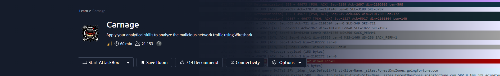


# Wireshark: Carnage

## Overview

This investigation focuses on analyzing the **carnage.pcap** packet capture after a workstation received a malicious Word document and the user clicked **"Enable Content."** The SOC team observed suspicious outbound connections from the workstation and provided the packet capture for investigation.

The objective was to identify the initial malicious download, trace subsequent malicious activity, identify Cobalt Strike command-and-control infrastructure, investigate post-infection traffic, and examine related DNS and SMTP activity.

> **Note:** All IP addresses and domains in this document have been defanged.

## Tools Used

- Kali Linux
- Wireshark
- VirusTotal Community tab

---

# Investigation Summary

## 1. First HTTP Connection to the Malicious IP

The HTTP traffic was filtered using:

```text
http
```

The packet's **Arrival Time** was then inspected.

### Finding

| Investigation | Result |
|--------------|--------|
| First HTTP connection to the malicious IP | `2021-09-24 16:44:38` |

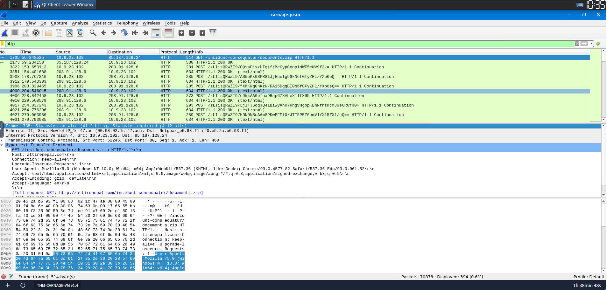

---

## 2. Name of the Downloaded ZIP File

The HTTP traffic was inspected to identify the file requested from the malicious server.

### Finding

| Investigation | Result |
|--------------|--------|
| Downloaded ZIP file | `documents.zip` |

---

## 3. Domain Hosting the Malicious ZIP File

The HTTP request was inspected to identify the domain hosting the downloaded archive.

### Finding

| Investigation | Result |
|--------------|--------|
| Hosting domain | `attirenepal[.]com` |

---

## 4. File Contained Inside the ZIP Archive

The HTTP connection was investigated using **Follow → TCP Stream**. The response contained the ZIP archive data, allowing the filename inside the archive to be identified without downloading the file separately.

### Finding

| Investigation | Result |
|--------------|--------|
| File inside `documents.zip` | `chart-1530076591.xls` |

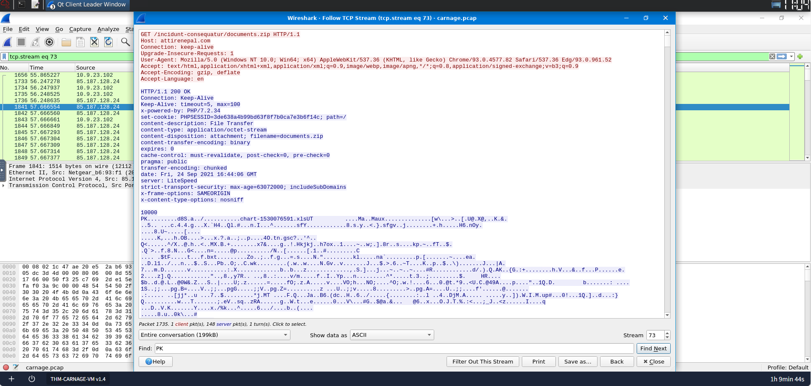

---

## 5. Webserver Used to Host the Malicious ZIP

The HTTP response headers were inspected to identify the webserver used by the malicious host.

### Finding

| Investigation | Result |
|--------------|--------|
| Webserver | `LiteSpeed` |

---

## 6. Webserver Version

The HTTP response headers also exposed the PHP version associated with the malicious webserver.

### Finding

| Investigation | Result |
|--------------|--------|
| Version | `PHP/7.2.34` |

---

## 7. Domains Used to Download Malicious Files

TLS Client Hello packets were filtered within the relevant time window:

```text
(tls.handshake.type == 1) &&
(frame.time >= "2021-09-24 16:45:11") &&
(frame.time <= "2021-09-24 16:45:30")
```

Three domains were identified as being involved in the malicious file-download activity.

### Findings

| Domain |
|--------|
| `finejewels[.]com[.]au` |
| `thietbiagt[.]com` |
| `new[.]americold[.]com` |

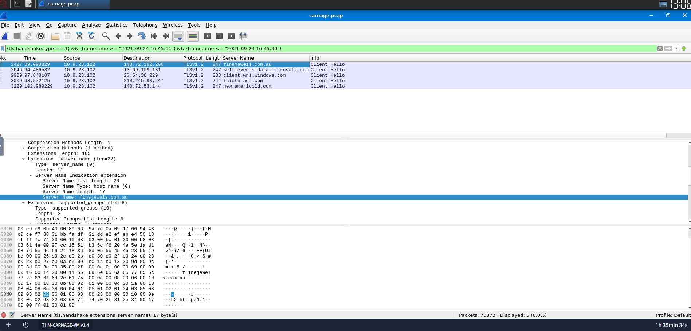

---

## 8. Certificate Authority for the First Malicious Domain

The TLS certificate traffic was filtered with:

```text
tls.handshake.type == 11 && ip.addr == 148[.]72[.]192[.]206
```

The certificate information was inspected to identify the issuing certificate authority.

### Finding

| Investigation | Result |
|--------------|--------|
| Certificate Authority | `GoDaddy` |

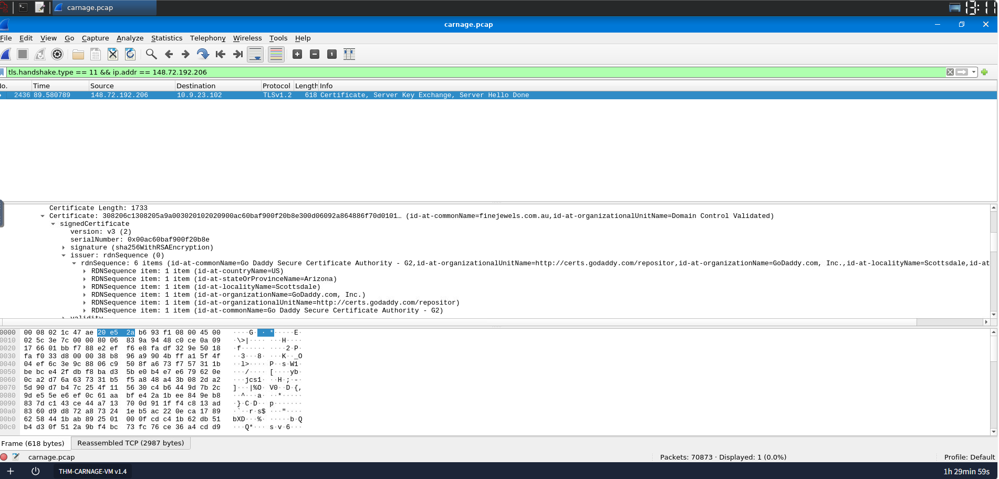

---

## 9. Cobalt Strike Command-and-Control Servers

The identified IP addresses were checked against the **VirusTotal Community** tab to confirm that they were associated with Cobalt Strike C2 infrastructure.

### Findings

| Cobalt Strike C2 IP |
|---------------------|
| `185[.]106[.]96[.]158` |
| `185[.]125[.]204[.]174` |

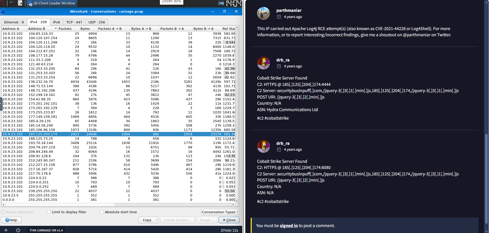

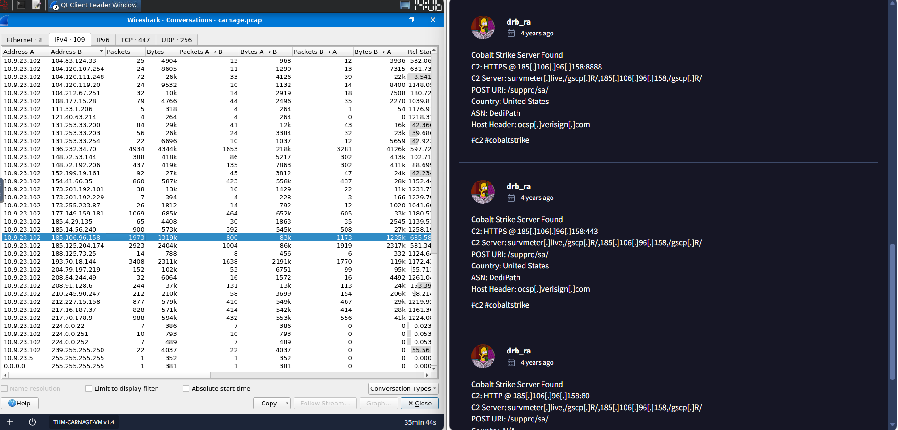

---

## 10. Host Header for the First Cobalt Strike IP

The HTTP traffic associated with the first Cobalt Strike server was inspected to identify the Host header.

### Finding

| Investigation | Result |
|--------------|--------|
| Host header | `ocsp[.]verisign[.]com` |

---

## 11. Domain Name for the First Cobalt Strike Server

The domain associated with the first Cobalt Strike server IP was identified during the traffic investigation.

### Finding

| Investigation | Result |
|--------------|--------|
| Cobalt Strike domain | `survmeter[.]live` |

---

## 12. Domain Name for the Second Cobalt Strike Server

The domain associated with the second Cobalt Strike server IP was identified.

### Finding

| Investigation | Result |
|--------------|--------|
| Cobalt Strike domain | `securitybusinpuff[.]com` |

---

## 13. Domain Used for Post-Infection Traffic

HTTP POST requests were isolated using:

```text
http.request.method == "POST"
```

The resulting traffic revealed the domain used for post-infection communication.

### Finding

| Investigation | Result |
|--------------|--------|
| Post-infection domain | `maldivehost[.]net` |

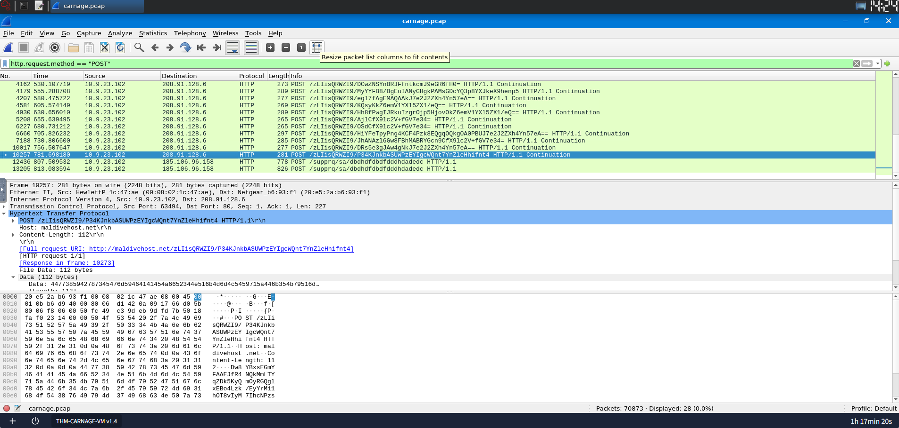

---

## 14. First Eleven Characters Sent to the Malicious Domain

The HTTP POST traffic was inspected to identify the first data sent by the victim host to the malicious domain.

### Finding

| Investigation | Result |
|--------------|--------|
| First eleven characters | `zLIisQRWZI9` |

---

## 15. Length of the First Packet Sent to the C2 Server

The first packet sent to the C2 server was inspected in Wireshark.

### Finding

| Investigation | Result |
|--------------|--------|
| Packet length | `281 bytes` |

---

## 16. Server Header of the Post-Infection Domain

HTTP response traffic was filtered using:

```text
http.response
```

The response headers were inspected to identify the server software.

### Finding

| Investigation | Result |
|--------------|--------|
| Server header | `Apache/2.4.49 (cPanel) OpenSSL/1.1.1l mod_bwlimited/1.4` |

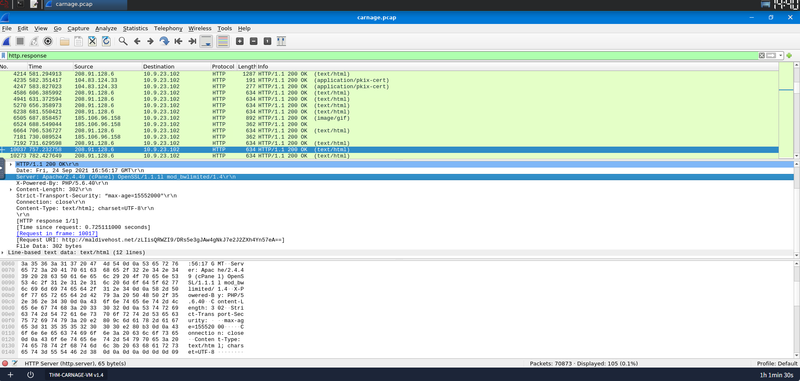

---

## 17. Time of the DNS Query Used for the Victim IP Check

DNS traffic was filtered using:

```text
dns
```

The relevant DNS query was identified as the malware checked for the victim's public IP address.

### Finding

| Investigation | Result |
|--------------|--------|
| DNS query time | `2021-09-24 17:00:04` |

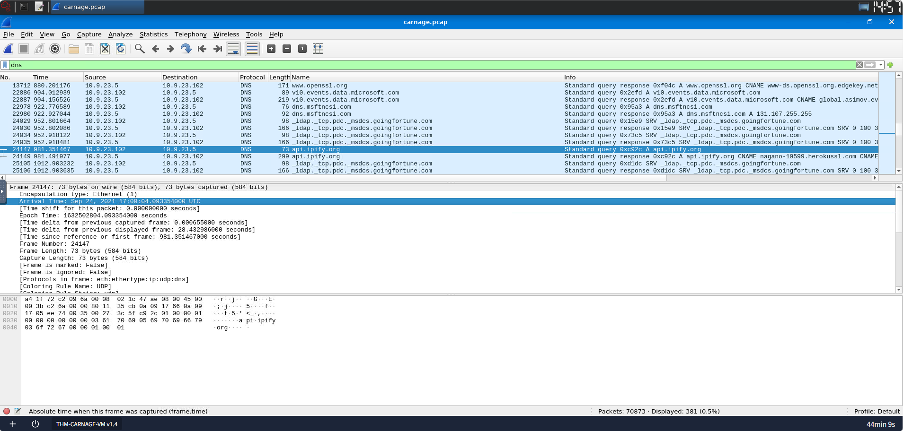

---

## 18. Domain Used for the Victim IP Check

The DNS query was inspected to determine which API domain was contacted by the malware.

### Finding

| Investigation | Result |
|--------------|--------|
| IP-check domain | `api[.]ipify[.]org` |

---

## 19. First MAIL FROM Address in the Malspam Activity

SMTP traffic was filtered using:

```text
smtp
```

The first `MAIL FROM` command observed in the traffic was inspected.

### Finding

| Investigation | Result |
|--------------|--------|
| First MAIL FROM address | `farshin@mailfa[.]com` |

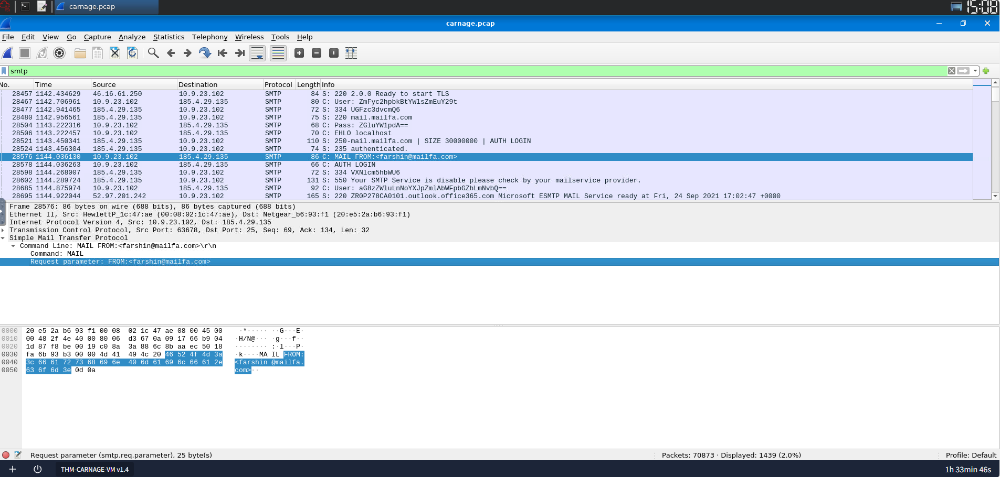

---

## 20. Number of SMTP Packets

The SMTP traffic was reviewed to determine the total number of packets observed.

### Finding

| Investigation | Result |
|--------------|--------|
| SMTP packets | `1439` |

---

# Attack Chain Summary

The packet capture shows a sequence of malicious activity beginning with the delivery and execution of a malicious document:

1. The victim opened a Word document and enabled its content.
2. The compromised host made an initial HTTP connection to a malicious server.
3. The host downloaded `documents.zip`.
4. The ZIP archive contained `chart-1530076591.xls`.
5. Additional malicious files were downloaded from multiple domains.
6. Cobalt Strike C2 infrastructure was identified.
7. The infected host communicated with the post-infection domain `maldivehost[.]net`.
8. The malware sent identifying data to the malicious infrastructure.
9. The malware queried `api[.]ipify[.]org` to determine the victim's public IP address.
10. SMTP traffic associated with malicious spam activity was also observed.

---

# Key Indicators of Compromise

## Malicious Domains

- `attirenepal[.]com`
- `finejewels[.]com[.]au`
- `thietbiagt[.]com`
- `new[.]americold[.]com`
- `survmeter[.]live`
- `securitybusinpuff[.]com`
- `maldivehost[.]net`

## Cobalt Strike C2 IP Addresses

- `185[.]106[.]96[.]158`
- `185[.]125[.]204[.]174`

## Related Host Header

- `ocsp[.]verisign[.]com`

## IP-Check Domain

- `api[.]ipify[.]org`

## Malspam Sender

- `farshin@mailfa[.]com`

## Downloaded Files

- `documents.zip`
- `chart-1530076591.xls`

---

# Skills Demonstrated

- Packet Inspection
- Network Traffic Analysis
- Protocol Analysis
- HTTP Traffic Analysis
- DNS Traffic Analysis
- TLS Certificate Analysis
- Malware Traffic Analysis
- Indicator of Compromise (IOC) Extraction
- Network Forensics

---

# Lessons Learned

- HTTP traffic can reveal malicious downloads, requested filenames, domains, and server information.
- **Follow TCP Stream** is useful for reconstructing application-layer conversations and examining transferred data.
- HTTP response headers can expose useful infrastructure information such as webserver software and versions.
- TLS Client Hello packets can reveal destination domains through the **Server Name Indication (SNI)** field.
- TLS certificate information can provide additional infrastructure details, including the certificate authority.
- Cobalt Strike infrastructure can be identified by correlating suspicious IP addresses with threat-intelligence sources such as VirusTotal.
- HTTP POST requests can reveal post-infection command-and-control communication.
- DNS traffic can expose services contacted by malware, including external APIs used to determine a victim's public IP address.
- SMTP traffic can provide evidence of malicious spam activity and reveal sender information.
- Combining Wireshark filters, packet inspection, TCP streams, DNS analysis, TLS analysis, and threat intelligence makes it possible to reconstruct a malware infection chain from a packet capture.

---

# Evidence Screenshots

The following screenshots were captured during the investigation:

- `images/http-get-method.png`
- `images/tcp-stream.png`
- `images/server-header.png`
- `images/domains.png`
- `images/cert-authority.png`
- `images/cobalt-1.png`
- `images/cobalt-2.png`
- `images/domain-name.png`
- `images/dns-query.png`
- `images/malspam.png`
